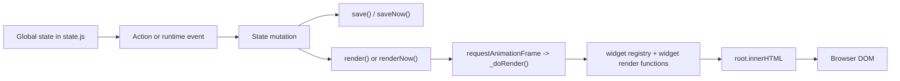

# Render Pipeline

This document traces the runtime path from state to DOM using the code in the
full repo copy under `ADHDashboard Repo/`.

## Pipeline Overview

Evidence:
`state.js` defines the mutable globals,
`actions_*.js` and `runtime.js` mutate them,
`storage.js` persists them,
and `render.js` turns them into DOM. See
`/Users/duif/Documents/ADHDashboard/ADHDashboard Repo/src/state.js:4-167`,
`/Users/duif/Documents/ADHDashboard/ADHDashboard Repo/src/actions_tasktimer.js:1-380`,
`/Users/duif/Documents/ADHDashboard/ADHDashboard Repo/src/actions_tasks.js:1-391`,
`/Users/duif/Documents/ADHDashboard/ADHDashboard Repo/src/actions_planner.js:57-368`,
`/Users/duif/Documents/ADHDashboard/ADHDashboard Repo/src/runtime.js:1-289`,
`/Users/duif/Documents/ADHDashboard/ADHDashboard Repo/src/storage.js:6-147`,
`/Users/duif/Documents/ADHDashboard/ADHDashboard Repo/src/render.js:94-208`.

## Detailed Flow

1. `state.js` declares mutable app state as globals.
2. User interactions in widgets call action functions through inline handlers or
   through the singleton listeners in `runtime.js`.
3. Actions mutate state and usually call `save()` or `saveNow()`.
4. `save()` debounces `_flushSave()`; `_flushSave()` writes localStorage and
   invalidates caches.
5. `render()` batches DOM work through `requestAnimationFrame`.
6. `_doRender()` either:
   * performs a full `root.innerHTML` rebuild, or
   * performs `_partialTimerUpdate()` when a `data-no-clobber="true"` input has
     focus.
7. `render.js` queries the widget registry, orders widgets from `widgetLayout`,
   and invokes each widget render function.
8. The resulting HTML becomes the DOM for the next interaction cycle.

## State -> Action -> Mutation -> Render -> DOM

### Example: task completion

* State: a task lives in `tasks[]`.
* Action: `toggleTask(id)` or `doneFocus()` is called.
* Mutation: the action updates `status` and `done`, and may clear focus.
* Render: `renderNow()` or `render()` runs after the save.
* DOM: the task row changes appearance in `render_tasks.js` and related views.

Evidence:
`/Users/duif/Documents/ADHDashboard/ADHDashboard Repo/src/actions_tasktimer.js:72-86`,
`/Users/duif/Documents/ADHDashboard/ADHDashboard Repo/src/actions_tasktimer.js:145-153`,
`/Users/duif/Documents/ADHDashboard/ADHDashboard Repo/src/render_tasks.js:436-465`.

### Example: timer tick

* State: `timerSecs`, `timerRunning`, `activeSession`.
* Action: `startTimerInternal()` creates the interval.
* Mutation: the interval decrements or increments `timerSecs`.
* Render: `_partialTimerUpdate()` patches readouts without a full rebuild when safe.
* DOM: timer labels, rings, and the board timer label update in place.

Evidence:
`/Users/duif/Documents/ADHDashboard/ADHDashboard Repo/src/actions_tasktimer.js:255-290`,
`/Users/duif/Documents/ADHDashboard/ADHDashboard Repo/src/render.js:3-47`,
`/Users/duif/Documents/ADHDashboard/ADHDashboard Repo/src/render.js:104-112`.

### Example: planner scheduling

* State: `plannerView`, `plannerSelectedDate`, `plannerDayDumps`, and task `ts`.
* Action: planner handlers mutate either dump state or task schedule fields.
* Mutation: the planner may directly write `tasks[].ts` and `tasks[].durationMins`.
* Render: `renderPlannerWidget()` chooses month/week/day/dump subviews.
* DOM: the task list, planner view, and day log all show the new schedule.

Evidence:
`/Users/duif/Documents/ADHDashboard/ADHDashboard Repo/src/actions_planner.js:110-116`,
`/Users/duif/Documents/ADHDashboard/ADHDashboard Repo/src/actions_planner.js:197-215`,
`/Users/duif/Documents/ADHDashboard/ADHDashboard Repo/src/render_planner.js:500-524`.

## Violations / Friction Points

* Inline event handlers often mutate state directly inside HTML strings instead
  of going through a named action. Examples include planner day placement and
  day-start edits. Evidence:
  `/Users/duif/Documents/ADHDashboard/ADHDashboard Repo/src/render_planner.js:222-224`,
  `/Users/duif/Documents/ADHDashboard/ADHDashboard Repo/src/render_daylog.js:263-266`.
* `_doRender()` has a focused-input escape hatch (`data-no-clobber`) that
  partially renders around active form fields. This is practical, but it means
  render has special-case state about input safety. Evidence:
  `/Users/duif/Documents/ADHDashboard/ADHDashboard Repo/src/render.js:104-112`.
* `render.js` contains a special-case render signature for `focusboard`.
  That makes the registry contract non-uniform. Evidence:
  `/Users/duif/Documents/ADHDashboard/ADHDashboard Repo/src/render.js:155-163`.
* `runtime.js` owns many global listeners and directly calls feature actions.
  That keeps keyboard shortcuts centralized, but it is a second control plane.
  Evidence: `/Users/duif/Documents/ADHDashboard/ADHDashboard Repo/src/runtime.js:45-218`.
* `audio.js` and `actions_tasktimer.js` write some persistence keys directly,
  bypassing the normal `save()` boundary for the journal/audio case. Evidence:
  `/Users/duif/Documents/ADHDashboard/ADHDashboard Repo/src/audio.js:116-123`,
  `/Users/duif/Documents/ADHDashboard/ADHDashboard Repo/src/audio.js:175-181`.

## Takeaway

The repository does follow the intended local-first flow:
state changes are mostly action-driven, actions usually save, and rendering is
centralized.

The main exceptions are direct inline handlers, direct DOM patching for the
timer, and a few subsystems that still write to multiple stores in one action.
